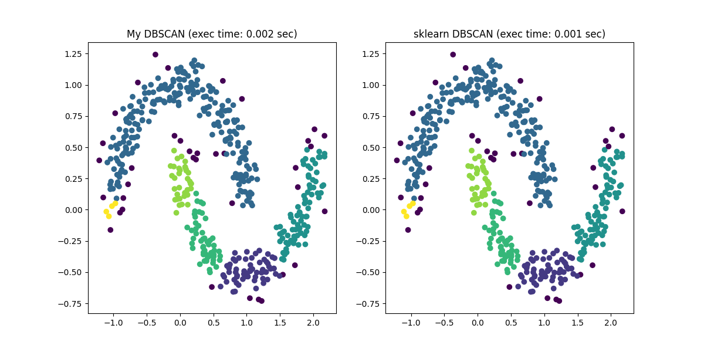

# DBSCAN
DBSCANをスクラッチで実装してみた

## Build Environment

1. install [rye](https://rye-up.com/)
   1. install instructions: https://rye-up.com/guide/installation/
2. enable [uv](https://github.com/astral-sh/uv) to speed up dependency resolution.
   ```bash
   rye config --set-bool behavior.use-uv=true
   ```
3. create a virtual environment
   ```bash
   rye sync
   ```

## RUN

```bash
rye run python main.py
```

## Results



## Templetes
- https://github.com/tubo213/research-template

## References

- [Ester, M., Kriegel, H. P., Sander, J., & Xu, X. (1996, August). A density-based algorithm for discovering clusters in large spatial databases with noise. In kdd (Vol. 96, No. 34, pp. 226-231).](https://cdn.aaai.org/KDD/1996/KDD96-037.pdf?source=post_page---------------------------)
